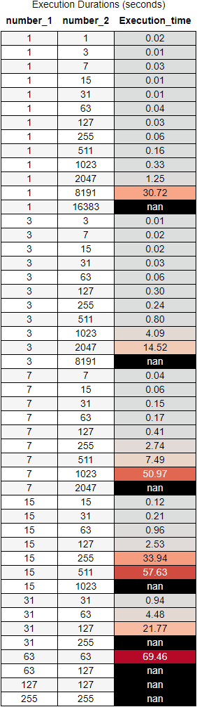

# Quantum Multiplier

This small-scale program builds and runs quantum circuits for integers multiplication.
The implementation is based on Fourier basis addition.

# Instructions

1. Copy the repository to your local machine (git clone https://github.com/ohadlev77/Quantum_Multiplier.git)
2. Run `main.ipynb` - The rest of the instruction appears within that file.

# Functionality

The program synthesizes a qunatum circuit appropriate for the integers multiplication chosen, and runs it on a simulator (the default backend is `ibmq_qasm_simulator`, consisted of 32 qubits).
it is possible to enter integers with different bitstring lengths.
The size of the integers is limited by the specification of the backend that we run the circuit upon - The circuit is consisted of $2(n + m)$ qubits, while $n$ and $m$ are the lengths of the integers' bitstrings. See the *performance* section for more details.
NOTE: Due to the nature of the Fourier multiplication algorithm it's practically impossible to achieve valueable results from NISQ hardware.

# Performance

I have 2 factors into account - The transpilation time and the running time of any circuit on `ibmq_qasm_simulator`.
Of course that the transpilation time varies between different computers since this process takes place locally, but I think this data is still useful.
90 seconds was fixed as the timeout bound for running 1 circuit, 1 shot (Since the simulator is noiseless 1 shot is enough) - Failed attempts that reached the timeout bound are maarked with -1 running time.
Since what affects the circuit depth and the gates count (and therefore the overall performance) is the number of qubits that are needed to represent the integer - In the following data samplings of all-ones bitstrings integers are shown (1, 3, 7, 15, and so on..).
In addition, due to the structure of the algorithm, it's much less complex to set the smaller integer as `number_1` and the larger integer as `number_2` compared to the opposite case. Even if the data is set the other way around, the program fix that (classically - that's a little 'cheat' but if `number_1` <= `number_2` in the first place it can be ignored).

### The execution and transpilation time data:

    
        dsa
        
    
    
        
    

